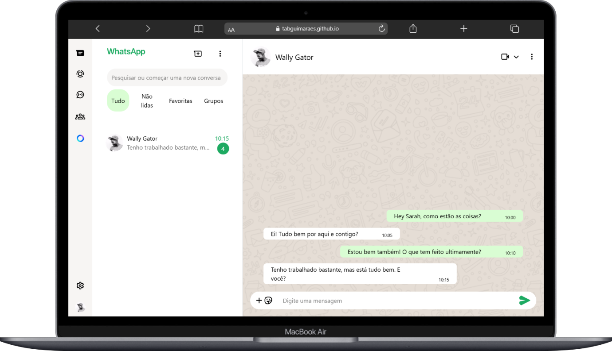

# Site estilo WhatsApp Web para testes de consumo de API

#

#

### Projeto feito para as aulas de frontend do segundo semestre do curso Técnico de Desenvolvimento de Sistemas do SENAI Jandira.

### O objetivo é testar a integração do frontend com uma API pública que retorne os contatos, mensagens, etc (ainda em construção).

### Todo o layout foi desenvolvido utilizando HTML, Tailwind CSS e JavaScript.
